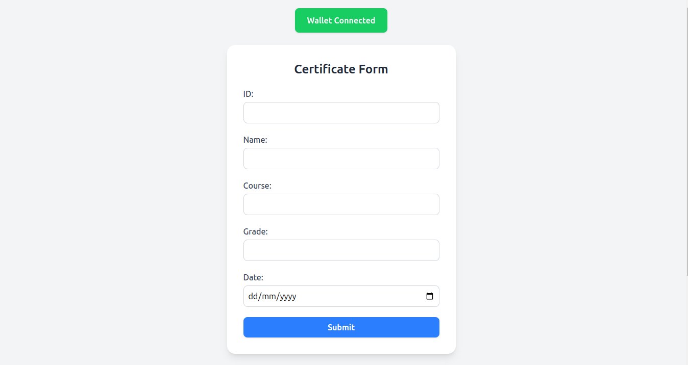
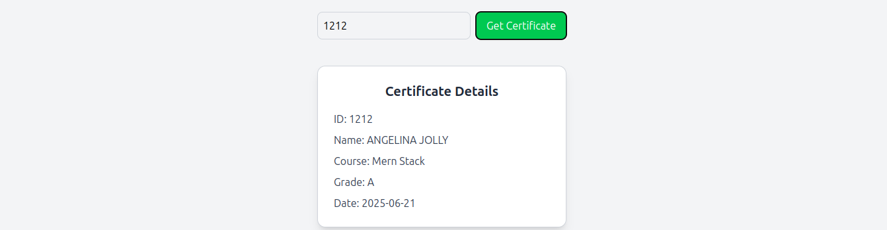

# 🎓 CertiChain — Blockchain Certificate Issuance DApp

CertiChain is a decentralized application (DApp) for securely issuing and verifying certificates on the blockchain. It allows authorized users to issue certificates with details like Name, Course, Grade, and Date, and anyone can fetch certificate details by their ID.

---

## 📌 Features

- 🔐 Connect with MetaMask wallet
- 📝 Issue certificates by entering details in a form
- 🔍 Fetch and view certificate details using Certificate ID
- 📄 All data is stored securely on the blockchain (via smart contract)
- 📦 Modern and clean React + Tailwind CSS frontend

---

## 🚀 Tech Stack

- **Frontend:** React.js, Tailwind CSS, Ethers.js
- **Blockchain:** Solidity Smart Contract
- **Wallet Integration:** MetaMask

---

## 📄 Smart Contract Functions

| Function            | Description                                 |
|:--------------------|:--------------------------------------------|
| `issueCert()`        | Issues a new certificate with given details |
| `getCert(uint _id)`  | Fetches certificate details by ID           |

---

## 📸 Screenshots

### Certificate Issuance Form

### Fetch Certificate Section

---

## ⚙️ Getting Started

### 📦 Prerequisites

- Node.js & npm
- MetaMask extension installed in browser
- Hardhat / Remix or any Solidity environment to deploy contract

---
